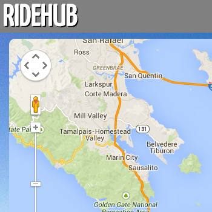

#RideHub

[Ridehub](http://ridehub.herokuapp.com/) is a cycling meetup app to connect cyclists. RideHub aims to by making it easier to find people to ride with by listing all local rides. Simply browse the map and join a ride!

Version 1.0

##### Ridehub is built using the following technologies:
- Ruby
- Javascript
- Sinatra
- Google Maps API
- JQuery
- AJAX